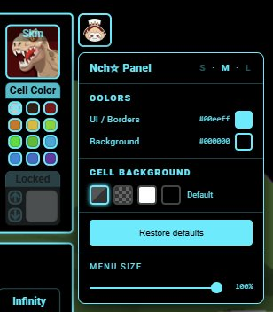
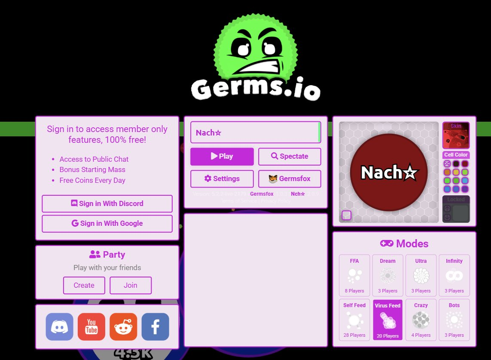
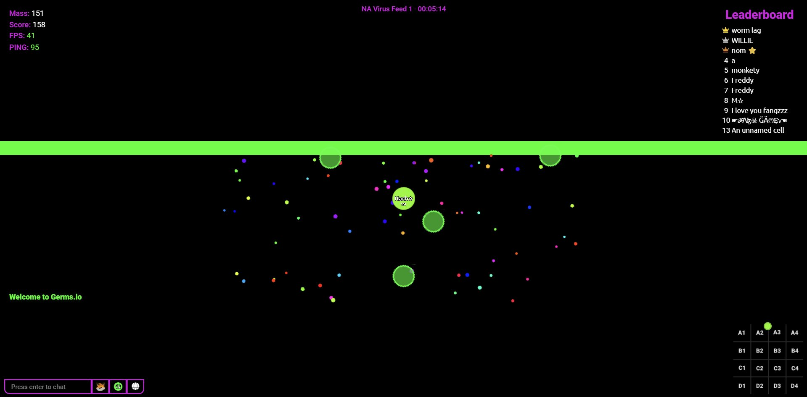

# NachGerms — UI Panel


<br>

<table width="100%">
  <tr>
    <td width="33%" align="center">
      
    </td>
    <td width="33%" align="center">
      
    </td>
    <td width="33%" align="center">
      
    </td>
  </tr>
</table>

---

> 🌐 **Language / Idioma**.
> 
> This document is available in two languages.
> **English version starts below** — **Spanish version** available further down.
>
> Este documento está disponible en dos idiomas.
> La **versión en inglés** comienza a continuación — la **versión en Español** se encuentra más abajo.

---

<br>

# NachGerms — UI Panel
### 🇬🇧 English

> Browser extension to customize the [Germs.io](https://germs.io/) interface.
> Change border, text, and background colors with a single click.
> ✅ Compatible with <a href="https://github.com/procrarast/germsfox" target="_blank">Germsfox</a> — will not override its colors.

---

## Features

- **Customizable UI color**
- **Customizable background**
- **Cell background**
- **Enhanced XP bar**
- All settings are saved automatically and persist between sessions.

## Installation

### Chromium / Chrome / Edge / Brave

1. Download or clone this repository:
   ```
   git clone https://github.com/sphynx137/nachgerms.git
   ```
   Or download the `.zip` from the green **<> Code** button and extract it.

2. Open `chrome://extensions` in your browser.
3. Enable **Developer mode** (top right corner).
4. Click **Load unpacked** and select the repository folder.

### Firefox

1. Download or clone the repository.
2. Open `about:debugging` in Firefox.
3. Click **This Firefox**.
4. Click **Load Temporary Add-on…** and select the `manifest.json` file.

> **Note:** In Firefox, temporary installations are removed when the browser is closed.

## Usage

Once installed, go to [germs.io](https://germs.io/) and click the extension icon in the browser toolbar to open the panel:

| Control | Function |
|---|---|
| **UI / Borders** | Primary color for borders, inputs, and text |
| **Background** | Background color for all panels |
| **Cell background** | Background visible behind your cell |
| **Restore** | Resets all values to their defaults |

You can also change the **Cell BG directly in-game** — look for the small square button in the bottom-left corner of your cell.

## Credits

Made by **Nach** for the [Germs.io](https://germs.io/) community.

---

<sub>This project is not affiliated with Germs.io or the developers of Germsfox.</sub>

<br>
<br>

---
---

<br>

# NachGerms — UI Panel
### 🇪🇸 Español

> Extensión de navegador para personalizar la interfaz de [Germs.io](https://germs.io/).
> Cambia colores de bordes, textos y fondo con un solo clic.
> ✅ Compatible con <a href="https://github.com/procrarast/germsfox" target="_blank">Germsfox</a> — no pisará sus colores.

---

## Características

- **Color UI personalizable**
- **Fondo personalizable**
- **Cell background**
- **XP bar mejorada**
- Todos los ajustes se guardan automáticamente y persisten entre sesiones.

## Instalación

### Chromium / Chrome / Edge / Brave

1. Descarga o clona este repositorio:
   ```
   git clone https://github.com/sphynx137/nachgerms.git
   ```
   O descarga el `.zip` desde el botón verde **<> Code** y extráelo.

2. Abre `chrome://extensions` en tu navegador.
3. Activa el **Modo de desarrollador** (esquina superior derecha).
4. Haz clic en **Cargar descomprimida** y selecciona la carpeta del repositorio.

### Firefox

1. Descarga o clona el repositorio.
2. Abre `about:debugging` en Firefox.
3. Haz clic en **Este Firefox**.
4. Haz clic en **Cargar complemento temporal…** y selecciona el archivo `manifest.json`.

> **Nota:** Para Firefox la instalación temporal se borra al cerrar el navegador.

## Uso

Una vez instalada, entra a [germs.io](https://germs.io/) y haz clic en el ícono de la extensión en la barra del navegador para abrir el panel:

| Control | Función |
|---|---|
| **UI / Bordes** | Color principal de bordes, inputs y texto |
| **Fondo** | Color de fondo de todos los paneles |
| **Cell background** | Fondo visible detrás de tu celda |
| **Restaurar** | Vuelve a los valores por defecto |

También puedes cambiar el **Cell BG directamente en el juego** — busca el pequeño botón cuadrado en la esquina inferior izquierda de tu celda.

## Créditos

Hecho por **Nach** para la comunidad de [Germs.io](https://germs.io/).

---

<sub>Este proyecto no está afiliado con Germs.io ni con los desarrolladores de Germsfox.</sub>
